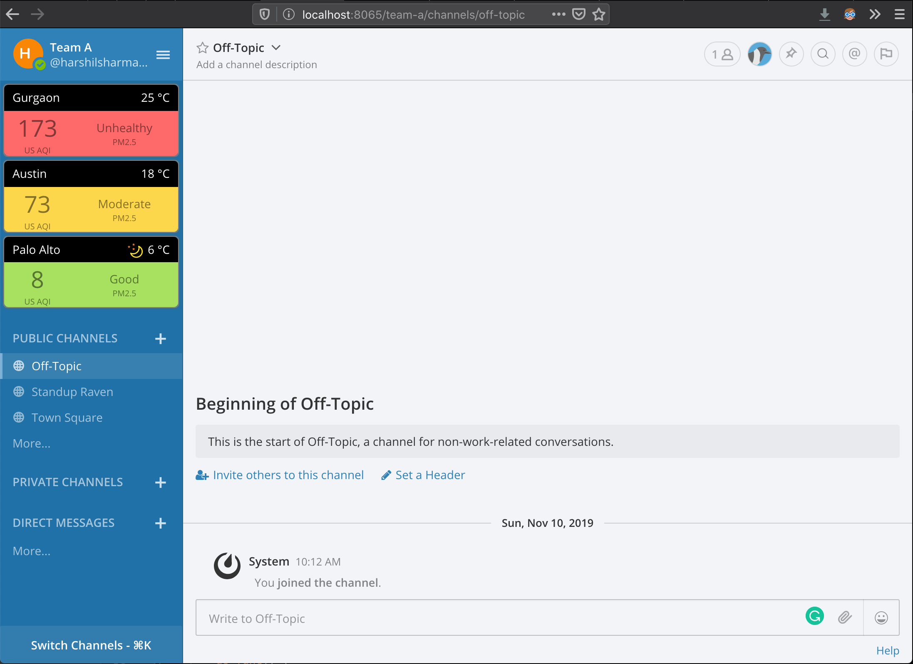

# Mattermost Plugin Air-Quality-Index

A Mattermost plugin for adding an AQI widget in left sidebar.

Air pollution is a very serious health concern and awareness is the first
step in resolving any problem. I live in a place with one of worst air pollution 
levels in the world, so keeping an eye on local AQI data is critical. Hence, this plugin.

Currently you need to list the cities in plugin settings in System Console, but it 
can be updated to allow users to subscribe to cities by self.

## Technical Details

Air pollution data is pulled from AirVisual APIs. A free plan is available with decent 
number of request limit.

The plugin adds a widget by registering a React component for left sidebar header, just like
Github plugin does.

